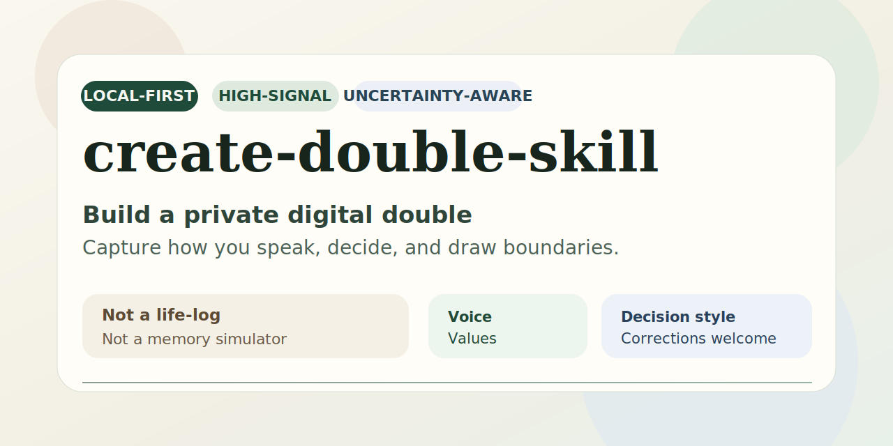

# create-double-skill / 分身.skill



Build a private digital double from guided answers.

把你做判断、设边界、给建议的方式，整理成一份能继续修改的本地档案。

## 三分钟跑通第一次

先安装依赖：

```powershell
python -m pip install -r requirements.txt
```

然后直接运行这一条：

```powershell
python scripts/double_builder.py start --slug my-work-double --display-name "工作分身" --use-case work
```

你会得到：

- `doubles/my-work-double/profile.yaml`
- `doubles/my-work-double/profile.md`
- `doubles/my-work-double/SKILL.md`

如果你想先检查环境，再开始第一次运行：

```powershell
python scripts/double_builder.py doctor
```

如果你在 Windows PowerShell 里看到中文预览乱码，先运行 `chcp 65001`，或者直接打开生成的 `profile.md`。

## 先看完整流程

```text
$ python scripts/double_builder.py start --slug my-work-double --display-name "工作分身" --use-case work
3 分钟内生成你的第一个 double，不需要写 JSON。

1/3 在工作里你最先保护什么？是质量、速度、关系、可维护性，还是别的？
> 可维护性、长期可持续、错误预期不要扩散

2/3 接到一个模糊任务时，你通常第一步会先问什么？
> 我会先问目标、成功标准和最不能出错的地方

3/3 同事或项目节奏让你不舒服时，你会怎么立边界或校正预期？
> 我会先把风险讲清楚，再给出我能接受的最小范围

已生成：
- profile.md: doubles/my-work-double/profile.md
- SKILL.md: doubles/my-work-double/SKILL.md

当前 preview：
- 主用途：工作协作版
- 优先保护：可维护性；长期可持续；错误预期不要扩散
- 给建议前先问：我会先问目标、成功标准和最不能出错的地方
- 设边界方式：我会先把风险讲清楚，再给出我能接受的最小范围
- 剩余细化问题：2
- 下一步：你在 review 或讨论里不同意别人时，通常会怎么说？

如果有一句不对，直接输入“我不会这么说...”或“我更在意...”，回车跳过：
> 我不会直接说“你应该”，我更常说“如果是我，我会先把风险讲清楚再决定”。

已应用 correction。

要不要继续细化 2 个问题？输入 "y" 继续，回车跳过：
> y
```

### 生成后的 `profile.md` 片段

```md
## Snapshot
- primary use case: `work`
- interview depth: `quick`

## Priorities
Confirmed:
- 可维护性
- 长期可持续
- 错误预期不要扩散

## Default Questions
Confirmed:
- 我会先问目标、成功标准和最不能出错的地方
```

这套流程首先抓的是：

- 你先保护什么
- 你先问什么
- 你怎么立边界

## 生成后怎么改

第一次生成完，最值得马上做的事不是继续堆资料，而是先改一句不对的话。

```powershell
python scripts/double_builder.py correct --slug my-work-double
```

然后直接输入：

```text
我不会直接说“你应该”，我更常说“如果是我，我会先把风险讲清楚再决定”。
```

这条命令会：

- 记录这句修正
- 回写到 `profile.yaml`
- 重新生成 `profile.md` 和 `SKILL.md`
- 把已经补上的待追问问题从队列里拿掉

## 现在也会自动积累私有知识库

从这版开始，`start` 和 `correct` 除了更新 `profile.yaml`，还会在本地悄悄积累一层高信号知识。

对普通使用者来说，这意味着：

- 你不用额外开任何服务
- 也不用手动整理完整聊天记录
- 重要的问答、修正和锚点例子会被压缩成可继续维护的本地知识页

默认会多出两类私有材料：

- `doubles/<slug>/kb/`
  每个分身自己的长期知识层
- `.project-kb/`
  这个仓库本身的私有维护知识库，只保留在本地，不会进入 Git

这里有一个重要边界：

- `profile.yaml` 仍然是唯一运行时真源
- `kb/` 更像长期积累和编译层，不是第二份并行 runtime 配置
- 不会默认保存整段聊天流水，更不会自动抓取高隐私数据

如果你只是第一次跑通，可以先忽略这一层。  
如果你想看它长什么样，再看 [examples/knowledge-base.md](examples/knowledge-base.md)。

## 先从哪一种分身开始

### 工作协作版

```powershell
python scripts/double_builder.py start --slug my-work-double --display-name "工作分身" --use-case work
```

适合整理你在协作、review、风险取舍和对齐预期时的判断方式。

### 自我对话版

```powershell
python scripts/double_builder.py start --slug my-dialogue-double --display-name "自我对话分身" --use-case self-dialogue
```

适合整理你卡住、焦虑、内耗时会怎么和自己说话。

### 对外表达版

```powershell
python scripts/double_builder.py start --slug my-external-double --display-name "对外表达分身" --use-case external
```

适合整理你面向别人表达时的分寸、边界和节奏。

### 想问得更深一点

```powershell
python scripts/double_builder.py start --slug my-double --display-name "我的分身" --use-case general --depth deep
```

- `quick`
  先问 3 个问题，尽快拿到第一版
- `standard`
  再多问 2 个细化问题
- `deep`
  再多问 4 个问题，并补至少 1 个真实例子

## 也支持自由描述

如果你不想逐题回答，也可以这样开始：

```powershell
python scripts/double_builder.py start --slug my-dialogue-double --display-name "自我对话分身" --use-case self-dialogue --mode freeform
```

你先写一段自述，系统先出第一版，再从对应的用途继续追问。

## 为什么值得信

- 默认只写本地 `doubles/`
- `profile.yaml` 是唯一结构化主档案
- 改过的话会写回去，不是一次性对话泡沫
- 不伪造经历、关系、时间线和具体记忆
- `profile.md`、`SKILL.md`、`history/` 都能直接看
- 资料不够时，会明确说这是推断

## 示例

第一次使用者建议先看：

- [examples/start-transcript-work.md](examples/start-transcript-work.md)
- [examples/generated-artifacts.md](examples/generated-artifacts.md)
- [examples/correction-before-after.md](examples/correction-before-after.md)

更多示例：

- [examples/start-transcript-general.md](examples/start-transcript-general.md)
- [examples/start-transcript-self-dialogue.md](examples/start-transcript-self-dialogue.md)
- [examples/start-transcript-external.md](examples/start-transcript-external.md)

如果你想继续用低层命令或自己写 payload，再看：

- [examples/README.md](examples/README.md)
- [examples/knowledge-base.md](examples/knowledge-base.md)
- [references/profile-schema.md](references/profile-schema.md)
- [references/payloads.md](references/payloads.md)

## 为什么建议分开建多个分身

你在工作里、和自己对话时、以及对外表达时，未必是同一种判断方式。  
所以当前更推荐你分开建多个 slug，而不是把多个侧面硬塞进同一个 profile。

例如：

- `my-work-double`
- `my-dialogue-double`
- `my-external-double`

## FAQ

### 我还需要写 JSON 吗

第一次跑通不需要。  
`start` 和 `correct` 都是自然语言入口。  
只有在你想走低层工作流或自定义 patch 时，才需要碰 payload。

### 它会上传我的数据吗

默认不会。当前版本是本地优先，产物默认只留在 `doubles/`。

### 不用 Codex 能跑吗

能。这个仓库本身就是一套本地脚本和文档。

### 如果输出不对，我怎么改

直接用：

```powershell
python scripts/double_builder.py correct --slug my-double
```

### `profile.yaml` 和 `SKILL.md` 有什么关系

`profile.yaml` 是结构化主档案。  
`profile.md` 是给人看的摘要。  
`SKILL.md` 是给运行时 double 用的约束和材料。

## 给 Codex 和其他 AI 编程助手

这个仓库不强依赖 Codex 才能运行。  
但它的结构很适合交给 Codex 这类 AI 编程助手继续安装、校验和修改。

如果你想把安装和首跑交给 AI 助手，可以直接把下面这段发给它：

```text
请帮我安装并验证 create-double-skill：

1. 安装 requirements.txt 里的依赖
2. 运行 python scripts/validate_repo.py
3. 运行 python -m unittest tests/test_double_builder.py -v
4. 如果检查都通过，直接帮我用 start 命令走通一次 work 或 self-dialogue 的第一次生成
5. 如果有报错，请直接修复，或者明确告诉我卡在哪里
```

## 检查仓库

```powershell
python scripts/validate_repo.py
python -m unittest tests/test_double_builder.py -v
```

## 更多文档

- [SKILL.md](SKILL.md)
- [prompts/interview.md](prompts/interview.md)
- [references/profile-schema.md](references/profile-schema.md)
- [examples/README.md](examples/README.md)
- [examples/knowledge-base.md](examples/knowledge-base.md)

## License

[MIT](LICENSE)
